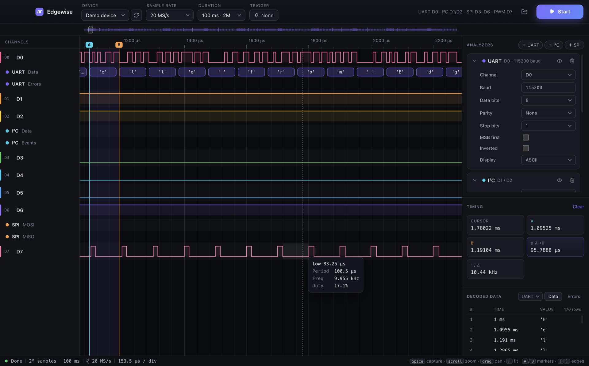

<p align="center">
  
</p>

<h1 align="center">Edgewise</h1>

<p align="center">A modern logic analyzer. Electron + React UI, Rust core.</p>



## Why

Saleae's Logic 2 sets the bar for logic analyzer software: fast, polished, a pleasure to use. It only works with Saleae hardware.

PulseView is the open alternative, and the sigrok project behind it is a huge achievement. It supports a vast range of hardware, and Edgewise builds on its work, including the open fx2lafw firmware. But the interface shows its age, and it can struggle with large captures.

Edgewise aims for both: a polished app that gives a $5 FX2 board from AliExpress the same experience as a top-of-the-range analyzer. It has a Rust core for large captures and native drivers, so it needs no vendor software. Today it supports FX2-based boards and a built-in demo device, with more hardware planned.

## Getting started

```bash
npm install
npm run dev      # builds the Rust addon, then launches the app
npm test         # Rust unit tests
```

Needs Rust (rustup) and Node 20+.

## Layout

- `crates/logic-core`: sample storage with per-chunk summary trees, edge search, decoders (UART, I²C, SPI), software trigger, `.sr` load/save, VCD export, devices (demo generator, native fx2lafw USB driver via `nusb`)
- `crates/logic-node`: N-API binding, copied to `native/logic.node` by `scripts/build-native.mjs`
- `src/main`: Electron main process; owns the engine, exposes a whitelisted IPC surface
- `src/renderer`: React UI; canvas waveform fed by per-pixel (first, toggle-mask) data from Rust

## Hardware

FX2-based boards running sigrok's `fx2lafw` firmware. If the board has no firmware yet, Edgewise uploads it. It looks for the `.fw` files in the app's firmware folder (File → Open Firmware Folder), in installed PulseView bundles, and in the usual `sigrok-firmware` locations.

## License

MIT
